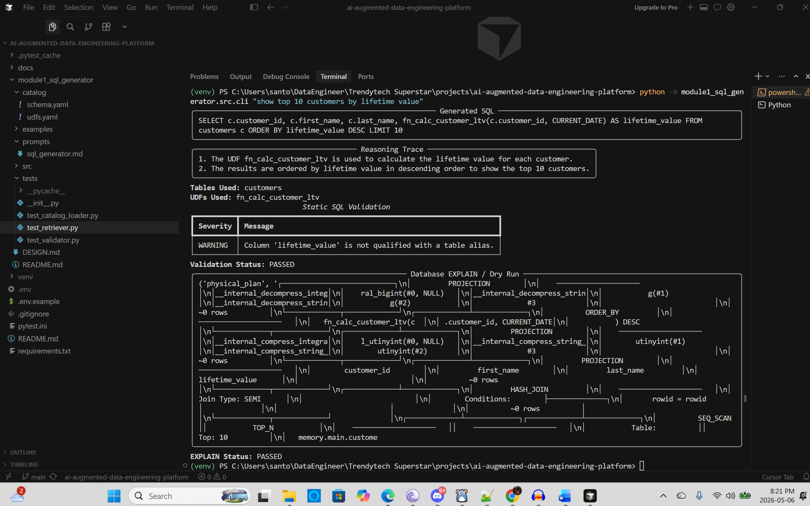

# AI-Augmented Data Engineering Platform

This repository contains solutions for the AI-Augmented Data Engineering Platform assignment.

---

# Modules

| Module | Description | Status |
|---|---|---|
| Module 1 | Intelligent SQL Generator | ✅ Completed |
| Module 2 | Intelligent Data Transformation Recommendation Engine | 🚧 Planned |
| Module 3 | Natural Language to Pipeline Generator | 🚧 Planned |
| Module 4 | Intelligent Data Quality & Anomaly Detection | 🚧 Planned |

---

# Module 1 — Intelligent SQL Generator

## Overview

Module 1 implements a metadata-aware and database-aware SQL generation system that converts natural language requests into validated PostgreSQL SQL queries.

The system supports:
- schema-aware SQL generation
- UDF-aware query generation
- structured reasoning traces
- static SQL validation
- database EXPLAIN / dry-run validation
- modular architecture

---

# High-Level Architecture

```text
User Prompt
    ↓
Catalog Loader
    ↓
Schema/UDF Retriever
    ↓
Prompt Builder
    ↓
LLM SQL Generator
    ↓
Static SQL Validator
    ↓
Database EXPLAIN / Dry Run
    ↓
Final SQL + Reasoning + Validation Report


Project Structure

ai-augmented-data-engineering-platform/
│
├── README.md
├── requirements.txt
├── pytest.ini
│
└── module1_sql_generator/
    ├── DESIGN.md
    │
    ├── catalog/
    │   ├── schema.yaml
    │   └── udfs.yaml
    │
    ├── prompts/
    │   └── sql_generator.md
    │
    ├── src/
    │   ├── models.py
    │   ├── catalog_loader.py
    │   ├── retriever.py
    │   ├── prompt_builder.py
    │   ├── llm_client.py
    │   ├── generator.py
    │   ├── validator.py
    │   ├── database_adapter.py
    │   └── cli.py
    │
    └── tests/
        ├── test_catalog_loader.py
        ├── test_retriever.py
        └── test_validator.py


Features

Schema-Aware SQL Generation

The generator uses database schema metadata to:

identify valid tables
identify valid columns
reduce hallucinations
improve SQL correctness
UDF-Aware Query Generation

The system dynamically retrieves relevant reusable UDFs using:

UDF metadata
tags
descriptions
business domains

This enables reusable business logic instead of duplicating calculations inline.

Structured Reasoning Trace

The LLM returns:

SQL query
reasoning steps
selected tables
selected UDFs
assumptions
warnings

This improves explainability and auditability.

Static SQL Validation

The validator checks:

SQL syntax
unsafe SQL
SELECT *
JOIN conditions
table existence
column existence
UDF existence
UDF argument counts
Database EXPLAIN / Dry Run

DuckDB-based EXPLAIN validation ensures:

query plan generation
parser acceptance
execution feasibility
Technologies Used
Purpose	Technology
Language	Python
LLM	OpenAI GPT
SQL Parsing	sqlglot
Validation	Pydantic
Local Database	DuckDB
Prompt Templating	Jinja2
CLI	Typer
Console UI	Rich
Testing	Pytest

# Demo Screenshot

