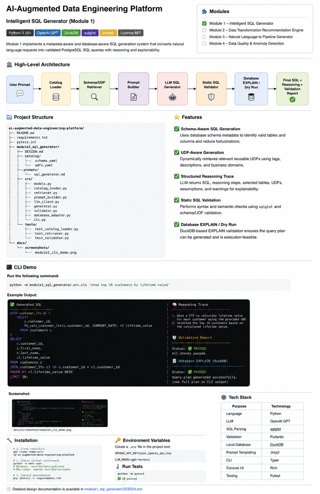
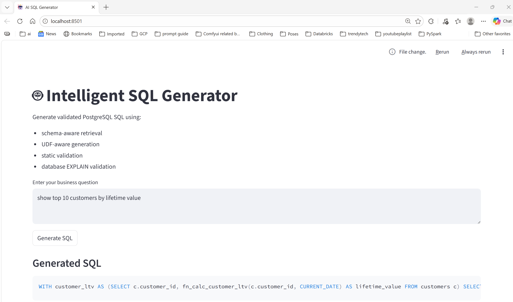
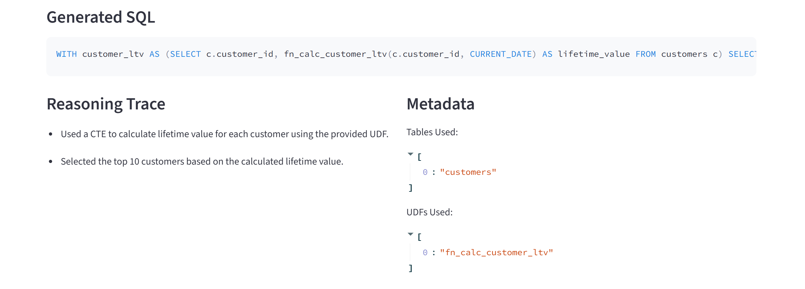
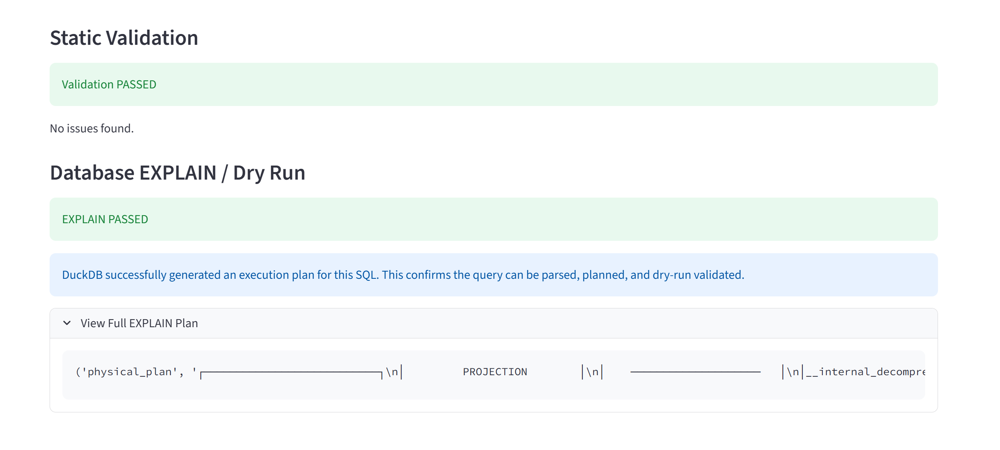

# AI-Augmented Data Engineering Platform

This repository contains solutions for the **AI-Augmented Data Engineering Platform** assignment.

---

# Modules

| Module | Description | Status |
|---|---|---|
| Module 1 | Intelligent SQL Generator | ✅ Completed |
| Module 2 | Intelligent Data Transformation Recommendation Engine | 🚧 Planned |
| Module 3 | Natural Language to Pipeline Generator | 🚧 Planned |
| Module 4 | Intelligent Data Quality & Anomaly Detection | 🚧 Planned |

---

# Module 1 — Intelligent SQL Generator

## Overview

Module 1 implements a **metadata-aware** and **database-aware** SQL generation system that converts natural language requests into validated PostgreSQL SQL queries.

The system supports:

- Schema-aware SQL generation
- UDF-aware query generation
- Structured reasoning traces
- Static SQL validation
- Database EXPLAIN / dry-run validation
- Streamlit UI integration
- Modular enterprise-style architecture

---

# Architecture Overview



---

# High-Level Architecture

```text
User Prompt
    ↓
Catalog Loader
    ↓
Schema/UDF Retriever
    ↓
Prompt Builder
    ↓
LLM SQL Generator
    ↓
Static SQL Validator
    ↓
Database EXPLAIN / Dry Run
    ↓
Final SQL + Reasoning + Validation Report
```

---

# Project Structure

```text
ai-augmented-data-engineering-platform/
│
├── README.md
├── requirements.txt
├── pytest.ini
│
├── docs/
│   └── screenshots/
│       ├── module1_architecture.png
│       ├── module1_cli_demo.png
│       ├── streamlit_home.png
│       ├── streamlit_generation.png
│       ├── streamlit_validation.png
│       └── pytest_success.png
│
└── module1_sql_generator/
    ├── DESIGN.md
    │
    ├── catalog/
    │   ├── schema.yaml
    │   └── udfs.yaml
    │
    ├── prompts/
    │   └── sql_generator.md
    │
    ├── examples/
    │   └── sample_prompts.md
    │
    ├── src/
    │   ├── models.py
    │   ├── catalog_loader.py
    │   ├── retriever.py
    │   ├── prompt_builder.py
    │   ├── llm_client.py
    │   ├── generator.py
    │   ├── validator.py
    │   ├── database_adapter.py
    │   └── cli.py
    │
    ├── tests/
    │   ├── test_catalog_loader.py
    │   ├── test_retriever.py
    │   └── test_validator.py
    │
    └── app.py
```

---

# Features

## ✅ Schema-Aware SQL Generation

The generator uses database schema metadata to:

- Identify valid tables
- Identify valid columns
- Reduce hallucinations
- Improve SQL correctness

---

## ✅ UDF-Aware Query Generation

The system dynamically retrieves relevant reusable UDFs using:

- UDF metadata
- Tags
- Descriptions
- Business domains

This enables reusable business logic instead of duplicating calculations inline.

---

## ✅ Structured Reasoning Trace

The LLM returns:

- SQL query
- Reasoning steps
- Selected tables
- Selected UDFs
- Assumptions
- Warnings

This improves explainability and auditability.

---

## ✅ Static SQL Validation

The validator checks:

- SQL syntax
- Unsafe SQL
- `SELECT *`
- JOIN conditions
- Table existence
- Column existence
- UDF existence
- UDF argument counts

---

## ✅ Database EXPLAIN / Dry Run

DuckDB-based EXPLAIN validation ensures:

- Query plan generation
- Parser acceptance
- Execution feasibility

---

## ✅ Interactive Streamlit UI

The project includes a Streamlit-based UI for:

- Natural language SQL generation
- Validation visualization
- EXPLAIN plan inspection
- Interactive demos

---

# Streamlit Demo

## Run Streamlit Application

```bash
streamlit run module1_sql_generator/app.py
```

---

## Streamlit Home Screen



---

## SQL Generation Demo



---

## Validation & EXPLAIN Demo



---

# CLI Demo

## Run CLI Command

```bash
python -m module1_sql_generator.src.cli "show top 10 customers by lifetime value"
```

---

## Example Prompt

```text
show top 10 customers by lifetime value
```

---

## Example Output

### Generated SQL

```sql
WITH customer_ltv AS (
    SELECT
        c.customer_id,
        fn_calc_customer_ltv(c.customer_id, CURRENT_DATE) AS lifetime_value
    FROM customers c
)
SELECT
    c.customer_id,
    c.first_name,
    c.last_name,
    cl.lifetime_value
FROM customers c
JOIN customer_ltv cl
    ON c.customer_id = cl.customer_id
ORDER BY cl.lifetime_value DESC
LIMIT 10;
```

---

### Reasoning Trace

```text
1. Used a CTE to calculate lifetime value for each customer using the provided UDF.
2. Selected the top 10 customers based on the calculated lifetime value.
```

---

### Validation Status

```text
Validation Status: PASSED
EXPLAIN Status: PASSED
```

---

# Testing

## Run Tests

```bash
python -m pytest
```

Expected:

```text
10 passed
```

---

## Pytest Success Screenshot


---

# Technologies Used

| Purpose | Technology |
|---|---|
| Language | Python |
| LLM | OpenAI GPT |
| SQL Parsing | sqlglot |
| Validation | Pydantic |
| Local Database | DuckDB |
| Prompt Templating | Jinja2 |
| CLI | Typer |
| Web UI | Streamlit |
| Console UI | Rich |
| Testing | Pytest |

---

# Installation

## Clone Repository

```bash
git clone <repo-url>
cd ai-augmented-data-engineering-platform
```

---

## Create Virtual Environment

### Windows

```bash
python -m venv venv
venv\Scripts\activate
```

### Mac/Linux

```bash
python -m venv venv
source venv/bin/activate
```

---

## Install Dependencies

```bash
pip install -r requirements.txt
```

---

# Environment Variables

Create a `.env` file in the project root:

```env
OPENAI_API_KEY=your_openai_api_key
LLM_MODEL=gpt-4o-mini
```

---

# Quality Dimension Coverage

| Dimension | Implementation |
|---|---|
| Accuracy | sqlglot + schema/UDF validation |
| Reusability | UDF catalog + retriever |
| Validation | Static validator + EXPLAIN |
| Reasoning | Structured reasoning trace |
| Data Freshness | Catalog versioning + refresh metadata |

---

# Sample Prompts

Additional sample prompts are available in:

```text
module1_sql_generator/examples/sample_prompts.md
```

---

# Design Documentation

Detailed design documentation is available in:

```text
module1_sql_generator/DESIGN.md
```

---

# Future Improvements

Potential enhancements include:

- Embedding-based retrieval
- Hybrid semantic search
- Metadata-aware RAG
- Lineage-aware SQL generation
- Cost-based query optimization
- Governance-aware query generation
- Multi-database dialect support
- Row-level security awareness

---

# Conclusion

This project demonstrates a production-oriented approach to AI-assisted SQL generation by combining:

- Metadata grounding
- Reusable business logic
- Controlled prompting
- Validation layers
- Explainability
- Streamlit UI integration
- Modular architecture

The implementation prioritizes:

- Reliability
- Accuracy
- Explainability
- Extensibility
- Enterprise-style engineering practices